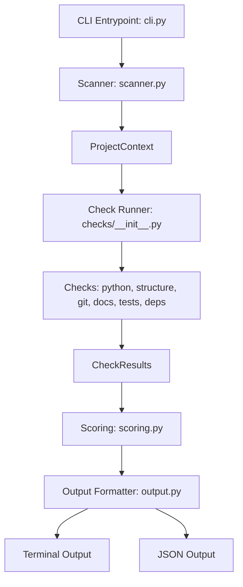

# Architecture: pyenvprobe

This document describes the design and internal architecture of `pyenvprobe`.

## Design Goals
1. **Zero External Runtime Dependencies (on Python 3.11+)**: Keep runtime fast and overhead minimal.
2. **Deterministic & Testable**: Scanning and scoring must yield identical results given the same filesystem structure.
3. **Pluggable & Extensible**: Adding a new check should only require adding a class or function and registering it, without changing CLI, scanner, or scoring code.
4. **Platform Agnostic**: Full compatibility with Windows, macOS, and Linux.

## Component Overview



### 1. Data Models (`models.py`)
- **`Status` (Enum)**: `PASS`, `WARN`, `FAIL`, `SKIP`, `INFO`
- **`Severity` (Enum)**: `LOW`, `MEDIUM`, `HIGH`, `CRITICAL`
- **`CheckResult` (Data Class)**:
  - `id`: Unique check identifier (e.g., `PD001`).
  - `category`: Grouping (e.g., `git`).
  - `title`: Short title (e.g., `.gitignore found`).
  - `status`: Outcome status.
  - `severity`: Severity of the failure/warning.
  - `message`: Detailed finding description.
  - `recommendation`: Concrete step to resolve the issue.
  - `metadata`: Key-value pairs for machine readability.
- **`ProjectContext` (Data Class)**:
  Represents a cached snapshot of the target project directory. This prevents checks from doing redundant filesystem reads. It contains:
  - `root_path`: Absolute path to the project root.
  - `files`: Set of relative paths of all files in the project.
  - `dirs`: Set of relative paths of all directories in the project.
  - `pyproject`: Parsed `pyproject.toml` dictionary (or empty).
  - `requirements_files`: List of detected requirements files.
  - `git_info`: Dictionary with git status (is repo, gitignore content, unignored files, etc.).
  - `large_files`: List of files exceeding the size threshold.
  - `errors`: List of scanner/parsing error messages.

### 2. Scanner (`scanner.py`)
- Walks the target project directory up to a configurable maximum depth or file count (to prevent infinite loops in malformed repositories).
- Loads and parses `pyproject.toml` (using `tomllib` on 3.11+, and `tomli` as fallback).
- Detects if the directory is inside a Git repository by checking for `.git` folders in the target directory or its parent folders.
- Parses `.gitignore` rules (using simple glob matching or translating to regex) to identify which files are ignored.

### 3. Registry & Checks (`checks/`)
- A registry mapping category names to lists of Check functions or classes.
- Each check implements:
  ```python
  def run(context: ProjectContext) -> list[CheckResult]: ...
  ```
- All checks are completely stateless and execute in isolation.

### 4. Scoring Engine (`scoring.py`)
- The score is calculated deterministically from 0 to 100.
- Each check has a designated point value or deduction:
  - `PASS` / `INFO` / `SKIP`: No deductions.
  - `WARN`: Deducts a small percentage (e.g., 2 points for low severity, 5 for medium).
  - `FAIL`: Deducts more points based on severity (e.g., 10 for medium, 20 for high, 40 for critical).
- Essential checks (like `README` and `LICENSE` existence, Python configuration, `tests` folder) are weighted higher.
- A floor of 0 is enforced.

### 5. CLI & Formatters (`cli.py`, `output.py`)
- **Human-Readable Output**: Organized by check categories. Employs clean Unicode characters (`✓`, `⚠`, `✗`) and simple ANSI escape codes for coloring.
- **JSON Output**: Serializes results into a stable, machine-readable JSON structure conforming to `docs/JSON_SCHEMA.md`.
